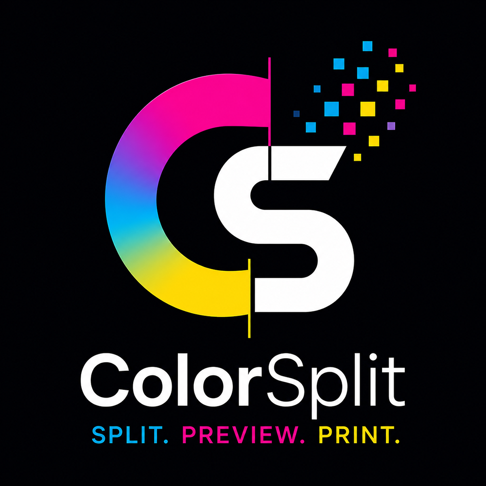

# ColorSplit

  

Automatic CMYK Color Separation for Professional Printing

---

## Overview

ColorSplit is a modern web application designed to automatically separate artwork into **Cyan, Magenta, Yellow, and Black (CMYK)** color channels for professional printing workflows.

The application is specifically developed to simplify color separation before printing on machines such as the **Caisheng CS-300-6C**, while remaining flexible enough to support other printing systems in the future.

Simply upload an image or artwork, and ColorSplit automatically:

- Detects the artwork
- Separates CMYK channels
- Generates individual color layers
- Displays live previews
- Prepares files for printing

---

## Features

- 🎨 Automatic CMYK Color Separation
- ⚡ Fast Processing
- 🖼️ Live Preview
- 📄 Multiple Image Format Support
- 🔍 Zoom & Preview
- 📥 Export Each Color Channel
- 🖨️ Optimized for Caisheng CS-300-6C
- 📱 Progressive Web App (PWA)
- 🌙 Modern Dark UI
- 💻 Works Offline

---

## Technology

- HTML5
- CSS3
- JavaScript (Vanilla)
- Canvas API
- Progressive Web App (PWA)
- Service Worker

---

## Roadmap

- Automatic CMYK Separation
- Spot Color Support
- PDF Import
- AI Color Detection
- Layer Management
- ICC Color Profile
- Ink Coverage Analysis
- Print Calibration
- Batch Processing
- Export TIFF / PNG / PDF

---

## Project Status

🚧 Under Development

ColorSplit is actively being developed with the goal of becoming a professional color separation solution for the printing industry.

---

## License

MIT License

---

Made with ❤️ for the Printing Industry.
